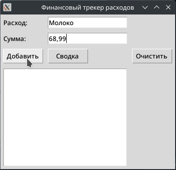
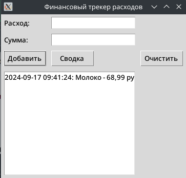
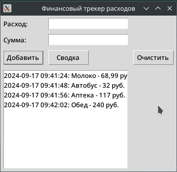
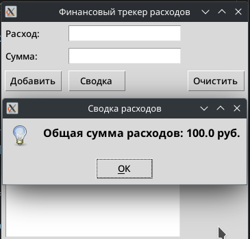
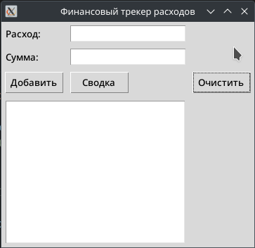

# Лабораторная №11
## Вариант №5
### Задание
1. Реализуйте приложение с GUI (приложения-игры допускается делать с использованием TUI-пакетов) по своему варианту. Можно изменить задание на собственную тему, согласовав с преподавателем. Список GUI фреймворков:
    - appJar
    - Tkinter
    - Flet
    - wxPython
    - PySimpleGUI
    - Pyforms
    - Toga
    - PyGObject
    - guizero
    - guietta
    - PySide6
    - Dear PyGui
    - PyGame

2. Оформите README.md. Он должен содержать:
    - Название вашего приложения
    - Описание
    - Инструкции по запуску
    - Краткую справку

#### Задание варианта №5

Финансовый трекер расходов

### Код
```python
import tkinter as tk
from tkinter import ttk
from tkinter import messagebox
import datetime

expenses = [] # Создание пустого списка для хранения информации о расходах.

def add_expense():  # В этой функции извлекаются значения из текстовых полей, а также записывается текущая дата и время
    expense = entry_expense.get() #  Извлекает значение из текстового поля entry_expense и сохраняет его в переменную expense.
    amount = entry_amount.get() # Извлекает значение из текстового поля entry_amount и сохраняет его в переменную amount
    date = datetime.datetime.now().strftime("%Y-%m-%d %H:%M:%S") # Получает текущую дату и время с помощью модуля datetime и сохраняет их в переменную date. Форматирование "%Y-%m-%d %H:%M:%S" определяет структуру строки даты и времени в год-месяц-день часы:минуты:секунды.

    expenses.append((date, expense, amount)) # Создает кортеж из значений date, expense и amount, и добавляет его в список expenses. Этот список используется для хранения информации о расходах.
    
    entry_expense.delete(0, tk.END) # Очищает текстовое поле entry_expense, удаляя все символы с позиции 0 до конца поля (tk.END).
    entry_amount.delete(0, tk.END) #  Очищает текстовое поле entry_amount, удаляя все символы с позиции 0 до конца поля (tk.END).

    update_expenses_list() # Вызов функции

def update_expenses_list(): # Функция удаляет все элементы списка
    listbox_expenses.delete(0, tk.END) # Удаляет все элементы из listbox_expenses, чтобы очистить список перед обновлением.
    for date, expense, amount in expenses: #  Проходит по каждому элементу в списке expenses.
        listbox_expenses.insert(tk.END, f"{date}: {expense} - {amount} руб.") # Вставляет в listbox_expenses новый элемент, содержащий дату, расход и сумму расхода. 

def clear_expenses(): # Чистка окна с расходами 
    expenses.clear()
    listbox_expenses.delete(0, tk.END)

def show_summary(): # Функция вычисляет общую сумму расходов
    total = sum(float(amount) for _, _, amount in expenses) # Эта строка вычисляет общую сумму расходов. Происходит итерация по каждому элементу в списке expenses.
    messagebox.showinfo("Сводка расходов", f"Общая сумма расходов: {total} руб.") # Окно будет содержать заголовок "Сводка расходов" и текст, включающий общую сумму расходов (total), которая будет отображаться как строка и завершаться словом "руб.".


# Оформление приложения
root = tk.Tk() # Окно приложения
root.title("Финансовый трекер расходов")

label_expense = ttk.Label(root, text="Расход:")
label_expense.grid(row=0, column=0, padx=5, pady=5, sticky=tk.W)

entry_expense = ttk.Entry(root)
entry_expense.grid(row=0, column=1, padx=5, pady=5, sticky=tk.W)

label_amount = ttk.Label(root, text="Сумма:")
label_amount.grid(row=1, column=0, padx=5, pady=5, sticky=tk.W)

entry_amount = ttk.Entry(root)
entry_amount.grid(row=1, column=1, padx=5, pady=5, sticky=tk.W)

button_add = ttk.Button(root, text="Добавить", command=add_expense)
button_add.grid(row=2, column=0, padx=5, pady=5, sticky=tk.W)


button_summary = ttk.Button(root, text="Сводка", command=show_summary)
button_summary.grid(row=2, column=1, padx=5, pady=5, sticky=tk.W)

button_clear = ttk.Button(root, text="Очистить", command=clear_expenses)
button_clear.grid(row=2, column=2, padx=5, pady=5, sticky=tk.W)

listbox_expenses = tk.Listbox(root)
listbox_expenses.grid(row=3, column=0, columnspan=2, padx=5, pady=5, sticky=tk.W+tk.E)

root.mainloop()
```
### Инструкция

Вводить нужно так:



Нажимаем ```добавить```:



Добавим еще несколько позиций:



Нажимаем ```сводка```:



Чтобы почистить окно с расходами, нажимаем ```очистить```:



## Список использованных источников
1. [Tkinter](https://skillbox.ru/media/code/pishem-desktopprilozhenie-na-python-s-pomoshchyu-tkinter/)
2. [Tkinter 2](https://www.youtube.com/watch?v=mLySBcS-6p0)
3. [Habr](https://habr.com/ru/articles/757112/)
